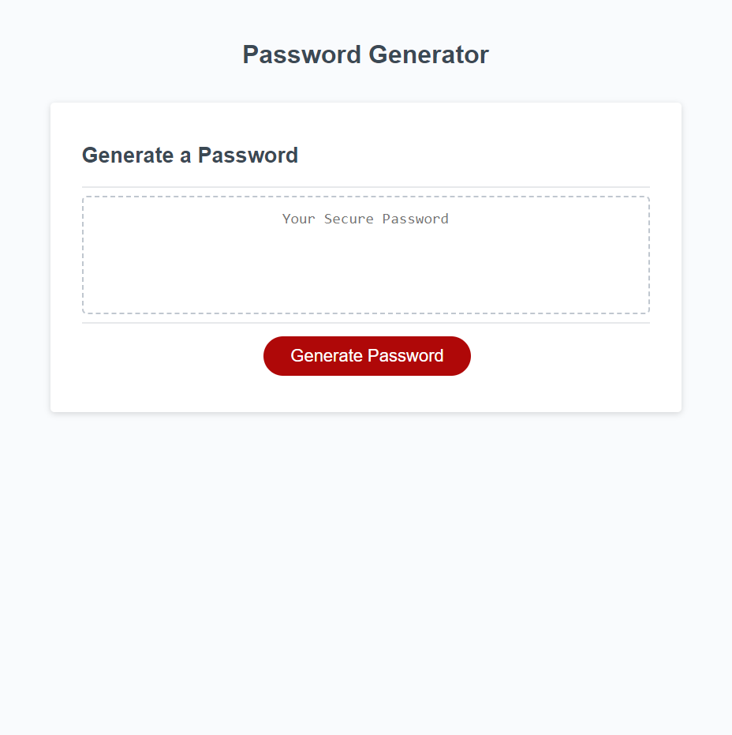

# Password-Generator

This Website generates random passwords based on the criteria provided by the user

## Deployment

Website: [Password Generater](https://corbinspence.github.io/Password-Generator/)

Once on the webpage, you press the "Generate Password" button to generate a password. Once pressed, you will be given the choice of providing a password length range and restrictions on what characters can be allowed. If you do not want to select a criteria, you just click "cancel" in the prompts. When completed, the website will display a new password based on your request.

## Author

Corbin Spence

## ScreenShot

